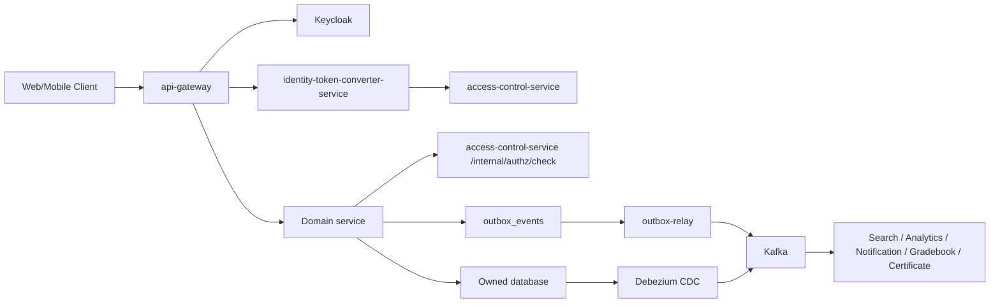

# CourseFlow LMS

CourseFlow là hệ thống Learning Management System hướng production cho đào tạo online và vận hành học tập doanh nghiệp. Dự án bao gồm trải nghiệm learner, backoffice admin/instructor/support, mobile app, cùng backend microservices tách boundary rõ ràng cho course, enrollment, assessment, certificate, analytics, notification, incentive và identity/authorization.

Mục tiêu của CourseFlow không chỉ là CRUD khóa học. Hệ thống được thiết kế để vận hành được vòng đời đầy đủ: tạo khóa học, review, publish, learner học nội dung, làm quiz/assignment, chấm điểm, cấp chứng chỉ, gửi thông báo, phân tích tiến độ, vận hành ưu đãi và xử lý các ca lỗi cần audit/recovery.

> Trạng thái hiện tại: hệ thống đã có nhiều capability lõi và có thể demo/hardening theo luồng nghiệp vụ chính. Chưa nên gọi production-ready enterprise nếu chưa hoàn tất các P0 gate ở phần [Production Readiness](#production-readiness).

## Mục Tiêu Sản Phẩm

| Nhóm | Mục tiêu |
|---|---|
| Learner | Tìm khóa học, đăng ký, học theo module, theo dõi tiến độ, nhận gợi ý khóa học, làm bài, xem điểm/chứng chỉ và lịch sử benefit |
| Instructor | Soạn course, quản lý curriculum, review readiness, theo dõi học viên, chấm điểm, phản hồi và vận hành lớp học |
| Admin/Ops | Quản lý user, role, course lifecycle, enrollment, notification, incentive, audit, reconciliation và remediation |
| Platform | Tách service ownership, event-driven integration, internal JWT, observability, DLT/outbox governance và khả năng mở rộng |

## Source Map

```text
courseflow/
  backend/                 Spring Boot services, gateway, workers, infra, docs
    common-library/        Shared response/error/correlation/security utilities
    event-contracts/       Immutable event records shared across services
    services/              Business microservices
    infra/                 Local Docker Compose, Keycloak realm, observability
    docs/                  Backend architecture, API, incentive, operation docs
  web/
    next-learning/         Learner/public web app using Next.js
    react-admin/           Backoffice/admin console using React + Vite
  app/                     Flutter learner mobile app
  docs/                    Cross-cutting engineering and review notes
```

## Product Surfaces

| Surface | Primary users | Main jobs |
|---|---|---|
| Learner Web | Public visitors, students | Course discovery, course detail, learning runtime, next action, related courses, reviews, progress |
| Admin Web | Admin, instructor, operator, support | Course authoring, publish governance, grading, learner success, notification, incentive ops |
| Mobile App | Students | Learning on the go, notification, progress and lightweight learner workflows |
| Backend APIs | Web/mobile/internal services | Identity propagation, domain workflows, reporting, events, audit and operational controls |

## Capability Overview

### Core LMS

- Course catalog, module/item authoring, material metadata and learner-facing course pages.
- Publish governance with draft/review/published state, immutable published curriculum snapshot and rollback/versioning direction.
- Enrollment, roster, waitlist/capacity decision boundary and learner progress.
- Learner Course Player and Next Action BFF direction for “học tiếp gì bây giờ”.
- Assignment, quiz, gradebook, peer review and certificate services for assessment lifecycle.
- Live session, discussion, announcement, deadline, portfolio and review domains for learning operations.

### Identity, Access And User Boundary

CourseFlow target architecture uses:

- Keycloak for enterprise IAM: login, SSO, MFA, password/session policy, federation and external access tokens.
- `identity-token-converter-service` for exchanging verified Keycloak tokens into short-lived CourseFlow internal JWTs.
- `access-control-service` for CourseFlow authorization: roles, permissions, scoped grants, product user status and authorization audit.
- `user-management-service` for profile/directory data: display name, avatar, bio, locale/timezone, profile visibility and admin user lifecycle facade.

The old custom password/JWT identity boundary is no longer the target architecture. If any `identity-service` style dependency still exists, treat it as legacy/compatibility debt and remove it only after a dependency audit confirms no active route, client or migration still depends on it.

### Enrollment, Commerce And Incentives

- Enrollment owns learner/course enrollment state and should not become the payment source of truth.
- Paid checkout/order boundary is required before production for any `finalAmount > 0`: order/payment must be authoritative, and promotion commit should happen only after payment success.
- Promotion service covers campaign/version/publish/rollback, coupon catalog/import, evaluate/reserve/commit/reverse runtime and audit/outbox.
- Loyalty service covers account/ledger/reward/tier skeleton, approval, benefit lifecycle direction and reconciliation hooks.
- Incentive production operation still needs unified support console, remediation, reconciliation, maker-checker and DLT governance before enterprise launch.

### Analytics And Recommendations

- `analytics-service` owns reporting read models, learner tracking ingestion, manual curated related courses and the learner-facing related-course read model.
- `recommendation-ml-service` is a standalone Python ML project for the related-course recommendation use case. It owns recommendation training pipelines, model registry, active model version, implicit collaborative filtering scores and internal inference endpoints.
- Related course recommendation now runs in two layers: analytics sends bounded, hashed training interactions to the Python ML service; ML trains/version-activates an item-item implicit collaborative filtering model; analytics materializes `source=ML` rows for learner display.
- Recommendation ML training accepts only `ENROLLMENT`, `CLICK` and `IMPRESSION` interaction event types; input is canonicalized before queue persistence so unsupported training data fails fast.
- If ML is disabled, unavailable or returns insufficient data, analytics falls back to the deterministic behavioral/co-enrollment heuristic so learner course pages do not go empty.
- Every generated recommendation carries source, reason code, model version, score and generated time. Public related-course output still filters to published courses only.

### Operations, Audit And Recovery

- Transactional outbox and Kafka are used for business-event integration.
- Debezium CDC is used where a projection should follow source tables, such as course search sync.
- DLT/outbox governance is a production gate: payload hash, topic/offset, retry count, error class, idempotent replay/discard and audit must be visible to operators.
- High-risk operations such as reverse redemption, reward override, large adjustment, expiry execution and DLT replay/discard need reason, evidence, threshold policy and maker-checker.

## Backend Architecture

CourseFlow backend is a set of Spring Boot services with explicit data ownership. Services should not share LMS business rules through common modules. Shared modules stay narrow:

| Module | Allowed responsibility |
|---|---|
| `common-library` | Response wrapper, error model, correlation id, service-info, narrow security helpers |
| `event-contracts` | Immutable event records only |

Current service map:

| Domain | Services |
|---|---|
| Platform/security | `api-gateway`, `discovery-service`, `identity-token-converter-service`, `access-control-service`, `user-management-service` |
| Course/runtime | `course-service`, `enrollment-service`, `organization-service`, `media-service`, `search-service` |
| Assessment | `assignment-service`, `quiz-service`, `gradebook-service`, `certificate-service`, `peer-review-service` |
| Engagement | `announcement-service`, `deadline-service`, `discussion-service`, `chat-service`, `notification-service`, `live-session-service`, `review-service`, `portfolio-service` |
| Analytics/incentive | `analytics-service`, `recommendation-ml-service`, `promotion-service`, `loyalty-service`, `outbox-relay` |

Standard service package shape:

```text
edu.courseflow.<service>/
  config/          Framework config, security, clients, messaging
  controller/      REST API boundary
  service/         Use cases and transaction scripts
  repository/      Persistence ports/adapters
  model/           Entities/documents/domain models
  dto/             Request/response DTOs
```

## Runtime Architecture



Important rules:

- `api-gateway` is the only client entrypoint and strips client-supplied identity headers.
- Domain services trust propagated identity only when a valid short-lived internal JWT is present.
- Each service owns its database/schema and exposes contracts through API/events, not direct table access.
- Search and analytics are read-model boundaries; source-of-truth data remains in the owning service.
- Gateway stays thin: routing, auth, CORS/rate limit, correlation id and header hardening.

## API Route Convention

| Gateway path | Audience |
|---|---|
| `/api/v1/**` | Learner/public API; public GET where explicitly allowed, otherwise JWT |
| `/api/admin/v1/**` | Admin/backoffice API; operator role required before routing |
| `/internal/**` | Service-to-service only; internal JWT/scope required |
| `/ws/**` | Realtime/WebSocket endpoints |

Service-internal controllers may use `/public/**`, `/internal/**`, `/backoffice/**` or service-specific paths, but gateway-facing API should keep the audience-first convention.

## Tech Stack

| Layer | Technology |
|---|---|
| Learner web | Next.js 15, React 19, TypeScript, TanStack Query, Tailwind CSS |
| Admin web | React 19, Vite, TypeScript, TanStack Query, Tailwind CSS, lucide-react |
| Mobile | Flutter |
| Backend | Java 21, Spring Boot 3, Spring Cloud Gateway |
| Identity/Auth | Keycloak OAuth2/OIDC, internal JWT/JWKS, CourseFlow access-control |
| Data | PostgreSQL per service, MongoDB for document/chat-style domains, Redis |
| Search | Elasticsearch, Spring Data Elasticsearch |
| Events | Kafka, transactional outbox, Debezium CDC, Kafka Connect |
| Storage | MinIO/S3-compatible object storage |
| Migration/Local infra | Liquibase, Docker Compose |

## Local Development

Start local infrastructure from `backend/`:

```bash
cd backend
docker compose -f infra/docker/docker-compose.yml up -d
```

Start the full backend cluster:

```bash
cd backend
docker compose \
  -f infra/docker/docker-compose.yml \
  -f infra/docker/docker-compose.services.yml \
  up --build
```

Run learner web:

```bash
cd web/next-learning
COURSEFLOW_API_URL=http://localhost:28080/api \
NEXT_PUBLIC_API_URL=http://localhost:28080/api \
npm run dev
```

Run admin web:

```bash
cd web/react-admin
VITE_API_GATEWAY_URL=http://localhost:28080/api npm run dev
```

Default local URLs:

| Component | URL |
|---|---|
| Learner web | `http://localhost:3000` |
| Admin web | `http://localhost:5173` |
| API gateway | `http://localhost:28080/api` |
| Keycloak | `http://localhost:18080` |
| Kafka Connect | `http://localhost:18083` |
| Elasticsearch | `http://localhost:9200` |
| MinIO console | `http://localhost:9001` |

Check course-search Debezium connector:

```bash
curl http://localhost:18083/connectors/courseflow-course-search-cdc/status
```

## Verification

Backend:

```bash
cd backend
mvn test
```

Targeted service gates:

```bash
cd backend
mvn -pl services/analytics-service -am test
mvn -pl services/access-control-service,services/user-management-service,services/notification-service -am test
mvn -pl services/outbox-relay -am test
```

Learner web:

```bash
cd web/next-learning
npm run lint
npm test
npm run build
```

Admin web:

```bash
cd web/react-admin
npm run lint
npm test
npm run build
```

Product hardening and smoke scripts are documented in [`backend/docs/operations/product-hardening-sprint.md`](backend/docs/operations/product-hardening-sprint.md).

## Production Readiness

CourseFlow should not be treated as enterprise production-ready until these P0 gates are complete and verified:

| P0 gate | Required outcome |
|---|---|
| Production Security Gate | Service-to-service JWT, access-control model, user-management boundary and old identity mechanism fully retired |
| Core LMS Authoring | Course Builder, module/item CRUD, readiness checks and preview are operator-ready |
| Publish Governance | Review audit, checklist, diff, rollback and immutable snapshot guarantee |
| Learner Runtime | Course Player and Learner Next Action BFF are stable for paid/public learning |
| Paid Checkout / Order Boundary | Paid enrollment requires valid order/payment source of truth before activation |
| Incentive Ops | Unified support console for enrollment, promotion, coupon, loyalty, outbox/DLT and audit lookup |
| Remediation Workflow | `COMMIT_FAILED`, `MANUAL_REVIEW`, expired `RESERVED` and similar cases have assignee, notes, actions, retries, SLA age and audit |
| Financial / Benefit Reconciliation | Detect and resolve drift across promotion, loyalty, enrollment, reward and points ledger |
| Maker-checker | High-risk operations require reason, evidence, thresholds and separate approver |
| Outbox/DLT Governance | Unified DLT queue with idempotent replay/discard, payload hash, retry metadata and audit |

P1 after P0:

- Reward fulfillment lifecycle with provider adapter, webhook callback, retry/backoff, SLA and learner-visible status.
- Loyalty tiers with qualification window, downgrade/grace policy, audit and learner tier progress.
- Coupon distribution lifecycle with cohort/section/course/segment targeting, preview, approval, notification and revoke.
- Learner Incentive Hub for coupon, points, reward, pending benefit, history, eligibility reason and support case.
- Promotion simulation before publish.
- Refund/drop policy matrix for discount reverse, points clawback and reward reversal.
- Learner Success + Assessment Ops: at-risk dashboard, grading queue, certificate eligibility and grade publish audit.

P2 after core stability:

- Advanced stacking policy, marketing funnel analytics, fraud scoring, warehouse/export expansion, A/B incentive testing, realtime SSE, cohort/learning path expansion and enterprise component kit.

## Key Documents

- Backend architecture: [`backend/docs/architecture/backend-architecture.md`](backend/docs/architecture/backend-architecture.md)
- Keycloak enterprise adoption: [`backend/docs/architecture/keycloak-enterprise-adoption.md`](backend/docs/architecture/keycloak-enterprise-adoption.md)
- Incentive platform design: [`backend/docs/architecture/incentive-platform-design.md`](backend/docs/architecture/incentive-platform-design.md)
- Loyalty bounded context ADR: [`backend/docs/architecture/loyalty-bounded-context-adr.md`](backend/docs/architecture/loyalty-bounded-context-adr.md)
- API overview: [`backend/docs/api/courseflow-api.md`](backend/docs/api/courseflow-api.md)
- Product hardening sprint: [`backend/docs/operations/product-hardening-sprint.md`](backend/docs/operations/product-hardening-sprint.md)
- Engineering conventions: [`docs/engineering-conventions.md`](docs/engineering-conventions.md)
- Architecture review backlog: [`docs/architecture-review-backlog.md`](docs/architecture-review-backlog.md)
- Open-source research notes: [`docs/open-source-research.md`](docs/open-source-research.md)
