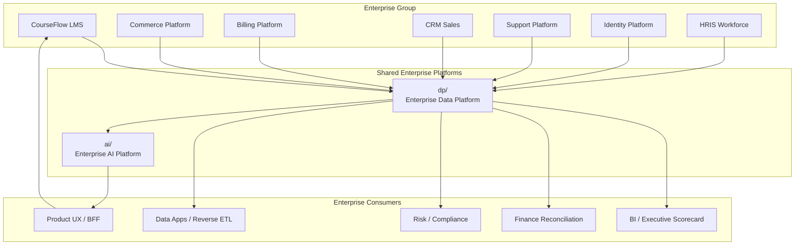
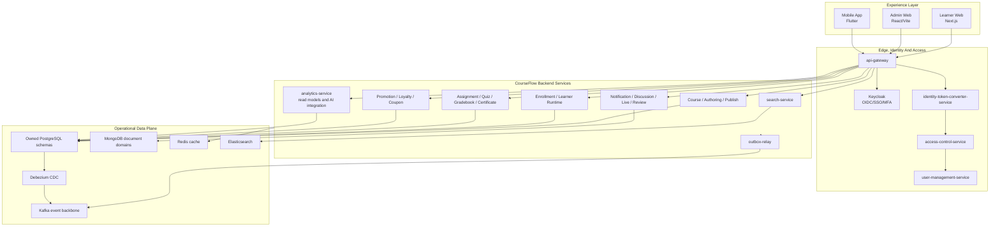
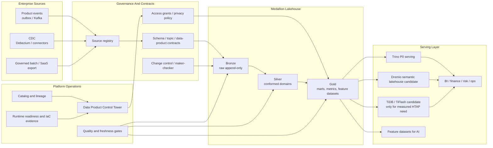
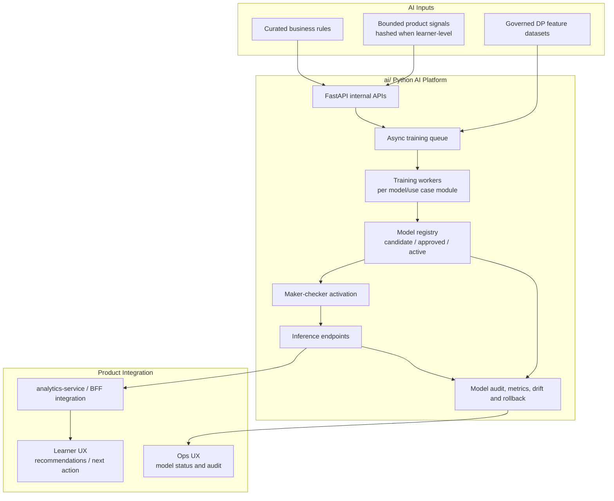
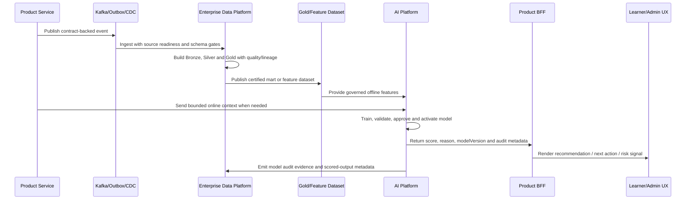
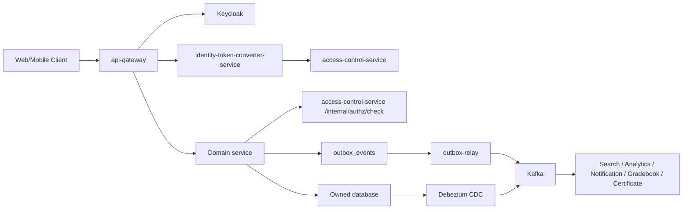

# CourseFlow LMS

CourseFlow là hệ thống Learning Management System hướng production cho đào tạo online và vận hành học tập doanh nghiệp. Workspace này cũng là nơi đặt hai platform ngang dùng lại cho tập đoàn: `ai/` là Enterprise AI Platform product và `dp/` là Enterprise Data Platform. LMS là sản phẩm đầu tiên được onboard, không phải giới hạn của nền tảng dữ liệu/AI.

Dự án bao gồm trải nghiệm learner, backoffice admin/instructor/support, mobile app, backend microservices tách boundary rõ ràng cho course, enrollment, assessment, certificate, analytics, notification, incentive và identity/authorization, cùng các nền tảng dữ liệu/ML phục vụ vận hành enterprise.

Mục tiêu của CourseFlow không chỉ là CRUD khóa học. Hệ thống được thiết kế để vận hành được vòng đời đầy đủ: tạo khóa học, review, publish, learner học nội dung, làm quiz/assignment, chấm điểm, cấp chứng chỉ, gửi thông báo, phân tích tiến độ, vận hành ưu đãi và xử lý các ca lỗi cần audit/recovery.

> Trạng thái hiện tại: hệ thống đã có nhiều capability lõi và có thể demo/hardening theo luồng nghiệp vụ chính. Riêng `dp/` hiện đã có enterprise control plane và local reference data-plane đủ để gửi partner review theo phạm vi kiểm chứng code/artifact, nhưng chưa nên gọi toàn hệ thống production-ready enterprise nếu chưa hoàn tất các P0 gate ở phần [Production Readiness](#production-readiness).

## Mục Tiêu Sản Phẩm

| Nhóm | Mục tiêu |
|---|---|
| Learner | Tìm khóa học, đăng ký, học theo module, theo dõi tiến độ, nhận gợi ý khóa học, làm bài, xem điểm/chứng chỉ và lịch sử benefit |
| Instructor | Soạn course, quản lý curriculum, review readiness, theo dõi học viên, chấm điểm, phản hồi và vận hành lớp học |
| Admin/Ops | Quản lý user, role, course lifecycle, enrollment, notification, incentive, audit, reconciliation và remediation |
| Platform | Tách service ownership, event-driven integration, internal JWT, observability, DLT/outbox governance, AI model ops, Data Platform và khả năng mở rộng |

## Source Map

```text
courseflow/
  backend/                 Spring Boot services, gateway, workers, infra, docs
    common-library/        Shared response/error/correlation/security utilities
    event-contracts/       Immutable event records shared across services
    services/              Business microservices
    infra/                 Local Docker Compose, Keycloak realm, observability
    docs/                  Backend architecture, API, incentive, operation docs
  web/
    next-learning/         Learner/public web app using Next.js
    react-admin/           Backoffice/admin console using React + Vite
  app/                     Flutter learner mobile app
  ai/                      Enterprise AI Platform product
    products/              AI platform charter and product onboarding registry
    use-cases/             Multi-domain AI portfolio registry
    platform/              AI lifecycle, governance, validation tooling and capabilities
    contracts/             Feature/model contracts for AI consumers
    services/
      recommendation-ml-service/
                            First runtime AI service: related-course recommendation
  dp/                      Group-wide Enterprise Data Platform
    contracts/             Event, topic, data-product and policy contracts
    products/              Product onboarding: LMS, commerce, billing, CRM, support, HRIS
    domains/               Enterprise data mesh domains and semantic ownership
    platform/              Ingestion, lakehouse, quality, catalog, serving, runtime, ops
    src/enterprise_dp/     Local validators and operating CLIs
  docs/                    Cross-cutting engineering and review notes
```

## Kiến Trúc Tổng Thể

CourseFlow được đặt trong kiến trúc enterprise theo bốn boundary rõ ràng:

- Experience: web, admin console và mobile app phục vụ learner, instructor, support và admin.
- Product runtime: backend microservices sở hữu giao dịch nghiệp vụ LMS, enrollment, assessment, incentive, notification và identity/authorization.
- AI platform: sản phẩm nền tảng độc lập cho nhiều use case ML/AI, gồm portfolio registry, training, model registry, activation, inference, audit, observability và governance. Recommendation chỉ là runtime service đầu tiên.
- Enterprise Data Platform: nền tảng dữ liệu dùng chung cấp tập đoàn cho nhiều sản phẩm, không chỉ LMS.

### Enterprise Context



### CourseFlow Runtime



### Enterprise Data Platform



### Enterprise AI Platform



### End-To-End Data And AI Flow



Architecture rules:

- Backend services own transactional state. DP and AI must not read product OLTP databases directly.
- Integration uses API contracts, events, outbox, CDC and governed source bridges, not shared tables.
- DP is group-wide. New enterprise products onboard through source registry, contracts, quality gates and catalog/lineage evidence.
- AI is a shared Python platform boundary. New ML use cases should add model/use-case modules inside `ai/`, reusing security, registry, activation, observability and feature governance instead of creating a separate service per use case by default.
- AI models consume approved feature datasets or bounded hashed interaction payloads, then return scored outputs with model version, reason code and audit metadata.
- Dremio and TiDB are candidate serving/runtime technologies. They enter production stack only after POC evidence shows they outperform the baseline for a concrete workload.

## Product Surfaces

| Surface | Primary users | Main jobs |
|---|---|---|
| Learner Web | Public visitors, students | Course discovery, course detail, learning runtime, next action, related courses, reviews, progress |
| Admin Web | Admin, instructor, operator, support | Course authoring, publish governance, grading, learner success, notification, incentive ops |
| Mobile App | Students | Learning on the go, notification, progress and lightweight learner workflows |
| Backend APIs | Web/mobile/internal services | Identity propagation, domain workflows, reporting, events, audit and operational controls |
| AI Platform | ML engineer, platform engineer, product services | Training jobs, model registry, activation approval, inference APIs and model audit |
| Enterprise Data Platform | Data platform, data steward, BI, finance, risk, AI teams | Data contracts, ingestion, lakehouse, quality, lineage, semantic datasets, feature datasets and Control Tower |

## Capability Overview

### Core LMS

- Course catalog, module/item authoring, material metadata and learner-facing course pages.
- Publish governance with draft/review/published state, immutable published curriculum snapshot and rollback/versioning direction.
- Enrollment, roster, waitlist/capacity decision boundary and learner progress.
- Learner Course Player and Next Action BFF direction for “học tiếp gì bây giờ”.
- Assignment, quiz, gradebook, peer review and certificate services for assessment lifecycle.
- Live session, discussion, announcement, deadline, portfolio and review domains for learning operations.

### Identity, Access And User Boundary

CourseFlow target architecture uses:

- Keycloak for enterprise IAM: login, SSO, MFA, password/session policy, federation and external access tokens.
- `identity-token-converter-service` for exchanging verified Keycloak tokens into short-lived CourseFlow internal JWTs.
- `access-control-service` for CourseFlow authorization: roles, permissions, scoped grants, product user status and authorization audit.
- `user-management-service` for profile/directory data: display name, avatar, bio, locale/timezone, profile visibility and admin user lifecycle facade.

The old custom password/JWT identity boundary is no longer the target architecture. If any `identity-service` style dependency still exists, treat it as legacy/compatibility debt and remove it only after a dependency audit confirms no active route, client or migration still depends on it.

### Enrollment, Commerce And Incentives

- Enrollment owns learner/course enrollment state and should not become the payment source of truth.
- Paid checkout/order boundary is required before production for any `finalAmount > 0`: order/payment must be authoritative, and promotion commit should happen only after payment success.
- Promotion service covers campaign/version/publish/rollback, coupon catalog/import, evaluate/reserve/commit/reverse runtime and audit/outbox.
- Loyalty service covers account/ledger/reward/tier skeleton, approval, benefit lifecycle direction and reconciliation hooks.
- Incentive production operation still needs unified support console, remediation, reconciliation, maker-checker and DLT governance before enterprise launch.

### Analytics And Recommendations

- `analytics-service` owns reporting read models, learner tracking ingestion, manual curated related courses and the learner-facing related-course read model.
- `ai/services/recommendation-ml-service` is the first standalone Python ML project under the AI platform. It owns recommendation training pipelines, model registry, active model version, implicit collaborative filtering scores and internal inference endpoints.
- Related course recommendation now runs in two layers: analytics sends bounded, hashed training interactions to the Python ML service; ML trains/version-activates an item-item implicit collaborative filtering model; analytics materializes `source=ML` rows for learner display.
- Recommendation ML training accepts only `ENROLLMENT`, `CLICK` and `IMPRESSION` interaction event types; input is canonicalized before queue persistence so unsupported training data fails fast.
- If ML is disabled, unavailable or returns insufficient data, analytics falls back to the deterministic behavioral/co-enrollment heuristic so learner course pages do not go empty.
- Every generated recommendation carries source, reason code, model version, score and generated time. Public related-course output still filters to published courses only.

### Enterprise Data Platform And AI Platform

- `dp/` is the group-wide data platform, not an LMS-only warehouse. CourseFlow LMS is the pilot product; commerce, billing, CRM, support, identity and workforce can onboard through the same registry and contract model.
- DP owns Bronze/Silver/Gold data products, event/topic contracts, source activation evidence, quality checks, catalog/lineage, semantic metrics, runtime readiness, access policy and Data Product Control Tower.
- DP partner-review status is intentionally split from production readiness: the current review pack can show `code_control_plane_ready_excluding_live_infra=true`, `partner_review_ready=true` and `production_ready=false` at the same time.
- DP `make ci` is the strict local gate for partner review. It runs validation, tests, live Apicurio schema-registry smoke, live Redpanda event-backbone smoke with generated ingestion runtime evidence, producer schema-id guard evidence, sink-side schema validation and multi-partition consumer-group lag-zero evidence for registered P0 source samples, live Redpanda broker ACL enforcement smoke, local Postgres transactional-outbox-to-Redpanda-to-Bronze preflight, live source-Postgres-outbox-to-Redpanda-to-Bronze-Iceberg/MinIO smoke with Trino read-back, local Bronze-Iceberg-to-Silver/Gold-Iceberg orchestrated publication smoke with Trino read-back and release activation evidence, live quality/SLO gate smoke over the published finance Gold Iceberg table, finance data-plane smoke, live Parquet/DuckDB lakehouse smoke, local PyIceberg catalog smoke, live MinIO object-store commit smoke with SSE-S3 deny/allow policy evidence, live Trino SQL runtime smoke, live Trino Iceberg/MinIO smoke with encrypted Iceberg object evidence, local Trino/PyIceberg catalog cross-engine commit smoke, local Trino runtime security smoke with allow/deny, row-filter, column-mask and structured audit-sink probes, local OPA policy decision smoke, local OIDC/JWKS auth smoke, local Dagster orchestration smoke, local Dagster Day-2 retry/tick/backfill smoke, portfolio release smoke and the production review pack with portfolio/schema-registry/event-backbone/broker-ACL/transactional-outbox/live-Bronze-ingestion/orchestrated-publication/live-quality-SLO/ingestion-runtime/live lakehouse/Iceberg/object-store/Trino/catalog-compat/catalog-runtime/orchestration-runtime/catalog-lineage/semantic-metrics/source-activation/access-privacy/Dagster evidence attached. The review pack removes `access-privacy-enforcement` only when Trino runtime security, OPA policy decisions and OIDC auth all pass strict evidence checks, removes `schema-registry-compatibility` only when an attached staging/prod `schema_registry_ops_report.v1` is production-like, externally attested, covers P0 source subjects and proves per-subject contract hash, payload schema hash, schema/artifact id, compatibility, producer enforcement and broker validation, removes `source-onboarding` only when an attached staging/prod `source_activation_ops_report.v1` is runtime-attested, production-like, covers every P0 source activation and has zero drift/pointer/runtime-readiness issues, removes production catalog runtime gaps only when an attached staging/prod `catalog_runtime_ops_report.v1` proves multi-AZ catalog HA, managed failover, stale-commit rejection, lost-update prevention, backup/restore/PITR, clean audit and external attestation, removes production orchestration runtime gaps only when an attached staging/prod `orchestration_runtime_ops_report.v1` proves Dagster daemon/scheduler/worker HA, distributed executor or Kubernetes run launcher, managed run storage, production retry/tick/backfill history, service identity, secret injection, metrics, audit and external attestation, removes production secret/KMS blockers only when an attached staging/prod `secret_rotation_ops_report.v1` proves managed secret-manager HA, workload identity federation, KMS/HSM custody, rotation policy, deny controls, SIEM audit export and zero P0 service coverage gaps, removes `catalog-lineage-control-plane` only when an attached staging/prod `catalog_lineage_ops_report.v1` is runtime-attested, production-like and hash-bound to catalog publish, OpenLineage and receipt evidence, removes `semantic-metric-serving` only when an attached staging/prod `semantic_metric_serving_ops_report.v1` is runtime-attested, production-like and backed by certified metrics, deployment evidence and usage evidence, and removes `platform-runtime-iac` only when staging/prod runtime readiness is built from full plan/apply/drift/backup/health evidence plus production DR where required.
- AI owns a standalone platform product: product onboarding registry, use-case portfolio, model lifecycle, training, model registry, activation workflow, inference, model audit, feature consumption and production model readiness.
- Recommendation is only the first AI use case. Future ML use cases across LMS, support, billing/finance, identity/risk, commerce and workforce should be added through the shared AI platform boundary when they can reuse model ops, security, observability and feature governance.
- DP provides governed feature datasets and semantic data products to AI. AI feeds scored outputs back to product services through internal APIs or governed activation datasets.

### Operations, Audit And Recovery

- Transactional outbox and Kafka are used for business-event integration.
- Debezium CDC is used where a projection should follow source tables, such as course search sync.
- DLT/outbox governance is a production gate: payload hash, topic/offset, retry count, error class, idempotent replay/discard and audit must be visible to operators.
- High-risk operations such as reverse redemption, reward override, large adjustment, expiry execution and DLT replay/discard need reason, evidence, threshold policy and maker-checker.

## Backend Architecture

CourseFlow backend is a set of Spring Boot services with explicit data ownership. Services should not share LMS business rules through common modules. Shared modules stay narrow:

| Module | Allowed responsibility |
|---|---|
| `common-library` | Response wrapper, error model, correlation id, service-info, narrow security helpers |
| `event-contracts` | Immutable event records only |

Current service map:

| Domain | Services |
|---|---|
| Platform/security | `api-gateway`, `discovery-service`, `identity-token-converter-service`, `access-control-service`, `user-management-service` |
| Course/runtime | `course-service`, `enrollment-service`, `organization-service`, `media-service`, `search-service` |
| Assessment | `assignment-service`, `quiz-service`, `gradebook-service`, `certificate-service`, `peer-review-service` |
| Engagement | `announcement-service`, `deadline-service`, `discussion-service`, `chat-service`, `notification-service`, `live-session-service`, `review-service`, `portfolio-service` |
| Analytics/incentive | `analytics-service`, `promotion-service`, `loyalty-service`, `outbox-relay` |
| AI/ML | `ai/services/recommendation-ml-service` |

Standard service package shape:

```text
edu.courseflow.<service>/
  config/          Framework config, security, clients, messaging
  controller/      REST API boundary
  service/         Use cases and transaction scripts
  repository/      Persistence ports/adapters
  model/           Entities/documents/domain models
  dto/             Request/response DTOs
```

## Backend Runtime Architecture

Sơ đồ này tập trung vào runtime backend của CourseFlow. Sơ đồ tổng thể ở trên thể hiện thêm lớp AI và Enterprise Data Platform.



Important rules:

- `api-gateway` is the only client entrypoint and strips client-supplied identity headers.
- Domain services trust propagated identity only when a valid short-lived internal JWT is present.
- Each service owns its database/schema and exposes contracts through API/events, not direct table access.
- Search and analytics are read-model boundaries; source-of-truth data remains in the owning service.
- Gateway stays thin: routing, auth, CORS/rate limit, correlation id and header hardening.

## API Route Convention

| Gateway path | Audience |
|---|---|
| `/api/v1/**` | Learner/public API; public GET where explicitly allowed, otherwise JWT |
| `/api/admin/v1/**` | Admin/backoffice API; operator role required before routing |
| `/internal/**` | Service-to-service only; internal JWT/scope required |
| `/ws/**` | Realtime/WebSocket endpoints |

Service-internal controllers may use `/public/**`, `/internal/**`, `/backoffice/**` or service-specific paths, but gateway-facing API should keep the audience-first convention.

## Tech Stack

| Layer | Technology |
|---|---|
| Learner web | Next.js 15, React 19, TypeScript, TanStack Query, Tailwind CSS |
| Admin web | React 19, Vite, TypeScript, TanStack Query, Tailwind CSS, lucide-react |
| Mobile | Flutter |
| Backend | Java 21, Spring Boot 3, Spring Cloud Gateway |
| Identity/Auth | Keycloak OAuth2/OIDC, internal JWT/JWKS, CourseFlow access-control |
| Data | PostgreSQL per service, MongoDB for document/chat-style domains, Redis |
| Search | Elasticsearch, Spring Data Elasticsearch |
| Events | Kafka, transactional outbox, Debezium CDC, Kafka Connect |
| Storage | MinIO/S3-compatible object storage |
| AI/ML | Python 3.11+, FastAPI, SQLAlchemy, Alembic, NumPy, scikit-learn, Prometheus metrics |
| Data Platform | Kafka/outbox/CDC, Apicurio Schema Registry local runtime smoke, Redpanda event-backbone multi-partition smoke and broker ACL smoke, Postgres transactional outbox smoke, live source Postgres outbox to Redpanda to Bronze Iceberg/MinIO smoke with Trino read-back, orchestrated Bronze Iceberg to Silver/Gold Iceberg publication smoke with Trino read-back and release activation evidence, live Trino quality/SLO gate smoke over published Gold Iceberg with runtime quality evidence and alert evidence, PyArrow Parquet local live slice, DuckDB local SQL probe, PyIceberg SQL catalog smoke, MinIO/S3 object-store commit smoke with SSE-S3 policy evidence, Trino memory SQL runtime smoke, Trino Iceberg/MinIO smoke with encrypted Iceberg object evidence, Trino/PyIceberg cross-engine catalog smoke, Trino file-based runtime security smoke, Dagster local run-history and Day-2 smoke, Apache Iceberg, Spark/dbt direction, Trino P0 serving |
| Data serving candidates | Dremio for semantic lakehouse/BI after POC; TiDB + TiFlash only for measured product-level HTAP needs |
| Migration/Local infra | Liquibase, Docker Compose |

## Local Development

The three runtime platforms stay independent locally. Start only the clusters you need.

Start backend infrastructure from `backend/`:

```bash
cd backend
docker compose -f infra/docker/docker-compose.yml up -d
```

Start the full backend cluster:

```bash
cd backend
docker compose \
  -f infra/docker/docker-compose.yml \
  -f infra/docker/docker-compose.services.yml \
  up --build
```

Start the AI platform cluster:

```bash
cd ai
docker compose -f infra/docker/docker-compose.yml up --build
```

Start the Data Platform cluster:

```bash
cd dp
docker compose -f platform/runtime/local/docker-compose.yaml up -d
```

Run learner web:

```bash
cd web/next-learning
COURSEFLOW_API_URL=http://localhost:28080/api \
NEXT_PUBLIC_API_URL=http://localhost:28080/api \
npm run dev
```

Run admin web:

```bash
cd web/react-admin
VITE_API_GATEWAY_URL=http://localhost:28080/api npm run dev
```

Default local URLs:

| Component | URL |
|---|---|
| Learner web | `http://localhost:3000` |
| Admin web | `http://localhost:5173` |
| API gateway | `http://localhost:28080/api` |
| AI Recommendation ML | `http://localhost:18088` |
| Keycloak | `http://localhost:18080` |
| DP Apicurio Schema Registry | `http://localhost:18082` |
| DP Trino | `http://localhost:18081` |
| Kafka Connect | `http://localhost:18083` |
| Elasticsearch | `http://localhost:9200` |
| MinIO console | `http://localhost:9001` |

Check course-search Debezium connector:

```bash
curl http://localhost:18083/connectors/courseflow-course-search-cdc/status
```

## Verification

Backend:

```bash
cd backend
mvn test
```

Targeted service gates:

```bash
cd backend
mvn -pl services/analytics-service -am test
mvn -pl services/access-control-service,services/user-management-service,services/notification-service -am test
mvn -pl services/outbox-relay -am test
```

AI service:

```bash
cd ai/services/recommendation-ml-service
make test
```

Enterprise Data Platform:

```bash
cd dp
make ci
```

Learner web:

```bash
cd web/next-learning
npm run lint
npm test
npm run build
```

Admin web:

```bash
cd web/react-admin
npm run lint
npm test
npm run build
```

Product hardening and smoke scripts are documented in [`backend/docs/operations/product-hardening-sprint.md`](backend/docs/operations/product-hardening-sprint.md).

## Production Readiness

CourseFlow should not be treated as enterprise production-ready until these P0 gates are complete and verified:

| P0 gate | Required outcome |
|---|---|
| Production Security Gate | Service-to-service JWT, access-control model, user-management boundary and old identity mechanism fully retired |
| Core LMS Authoring | Course Builder, module/item CRUD, readiness checks and preview are operator-ready |
| Publish Governance | Review audit, checklist, diff, rollback and immutable snapshot guarantee |
| Learner Runtime | Course Player and Learner Next Action BFF are stable for paid/public learning |
| Paid Checkout / Order Boundary | Paid enrollment requires valid order/payment source of truth before activation |
| Incentive Ops | Unified support console for enrollment, promotion, coupon, loyalty, outbox/DLT and audit lookup |
| Remediation Workflow | `COMMIT_FAILED`, `MANUAL_REVIEW`, expired `RESERVED` and similar cases have assignee, notes, actions, retries, SLA age and audit |
| Financial / Benefit Reconciliation | Detect and resolve drift across promotion, loyalty, enrollment, reward and points ledger |
| Maker-checker | High-risk operations require reason, evidence, thresholds and separate approver |
| Outbox/DLT Governance | Unified DLT queue with idempotent replay/discard, payload hash, retry metadata and audit |
| AI/ML Production Gate | Internal JWT, async training worker, model registry, maker-checker activation, active-model readiness, model audit, observability and fallback contract are verified |
| Enterprise Data Platform Gate | Source contracts, readiness bundle, Bronze/Silver/Gold quality, catalog/lineage/access policy, Control Tower report and runtime evidence are verified before production use |

Current DP wording for external review:

- Correct: enterprise-grade control plane plus local reference implementation, ready for partner architecture/artifact review.
- Incorrect: live production data platform.
- Remaining DP production blockers are production live-runtime/capability evidence such as deployed Debezium/Kafka Connect or outbox-relay-to-Bronze flow for all P0 sources, connector HA/secret rotation/backpressure, production catalog HA/concurrency and failover, production cloud KMS/key rotation and external bucket-policy attestation, production broker mTLS/secret rotation/audit export, managed quality runner/exporter rollout, production Alertmanager/PagerDuty route evidence and capability maturity. The source-to-Bronze local slice now has source Postgres outbox, Redpanda offsets, Bronze Iceberg/MinIO commits, Trino read-back, duplicate/idempotency, quarantine/DLT and resume-offset evidence for the finance benefit source; the Bronze-to-Silver/Gold local slice reads Bronze Iceberg, writes Silver/Gold Iceberg, verifies both via Trino, and generates promotion/activation/rollback-pointer/drift-negative evidence; the live quality/SLO slice queries the published finance Gold Iceberg table through Trino, emits non-synthetic runtime quality evidence, green SLO alert evidence, quality/SLO ops evidence and negative controls for corrupt Gold, stale freshness, red alert, environment mismatch and missing production-like alert evidence; schema registry compatibility now has a fail-closed production-like ops-report gate and local Apicurio/auth/storage evidence remains supporting evidence only, catalog runtime now has a fail-closed staging/prod ops-report gate over multi-AZ HA, managed failover, stale-commit denial, lost-update prevention, backup/restore/PITR, audit and attestation, orchestration runtime now has a fail-closed staging/prod ops-report gate over Dagster daemon/scheduler/worker HA, distributed executor or Kubernetes run launcher, managed run storage, production retry/tick/backfill history, service identity, secret injection, metrics, audit and attestation, catalog lineage now has a fail-closed staging/prod ops-report gate over publish manifest, OpenLineage and publish receipt hashes, semantic metric serving now has a fail-closed staging/prod ops-report gate over certified metrics, semantic view manifest, deployment evidence and usage telemetry, managed secret/KMS operations now has a fail-closed staging/prod gate over managed secret-manager HA, workload identity federation, KMS/HSM custody, rotation policy, deny controls, SIEM export and P0 runtime-service coverage, runtime/IaC now has a fail-closed staging/prod readiness gate over machine plan/apply/drift/backup/health/DR evidence, Trino/PyIceberg cross-engine commit compatibility has local shared-catalog evidence, access/privacy enforcement now has a strict combined gate over Trino runtime security, local OPA PDP maker-checker decisions and local OIDC/JWKS RS256 validation evidence, orchestrator injection has local encrypted versioned secret rotation evidence, and Dagster Day-2 now has a strict local gate for positive retry backoff, schedule tick history and backfill materialization history; those do not replace enterprise Keycloak realm deployment/HA/group sync, managed HA database, multi-AZ, managed catalog failover, production alert routing, signed policy bundle distribution or backup/restore/PITR controls unless the matching staging/prod evidence report is attached and strict-passing.

P1 after P0:

- Reward fulfillment lifecycle with provider adapter, webhook callback, retry/backoff, SLA and learner-visible status.
- Loyalty tiers with qualification window, downgrade/grace policy, audit and learner tier progress.
- Coupon distribution lifecycle with cohort/section/course/segment targeting, preview, approval, notification and revoke.
- Learner Incentive Hub for coupon, points, reward, pending benefit, history, eligibility reason and support case.
- Promotion simulation before publish.
- Refund/drop policy matrix for discount reverse, points clawback and reward reversal.
- Learner Success + Assessment Ops: at-risk dashboard, grading queue, certificate eligibility and grade publish audit.

P2 after core stability:

- Advanced stacking policy, marketing funnel analytics, fraud scoring, warehouse/export expansion, A/B incentive testing, realtime SSE, cohort/learning path expansion and enterprise component kit.

## Key Documents

- Backend architecture: [`backend/docs/architecture/backend-architecture.md`](backend/docs/architecture/backend-architecture.md)
- Keycloak enterprise adoption: [`backend/docs/architecture/keycloak-enterprise-adoption.md`](backend/docs/architecture/keycloak-enterprise-adoption.md)
- Incentive platform design: [`backend/docs/architecture/incentive-platform-design.md`](backend/docs/architecture/incentive-platform-design.md)
- Loyalty bounded context ADR: [`backend/docs/architecture/loyalty-bounded-context-adr.md`](backend/docs/architecture/loyalty-bounded-context-adr.md)
- AI recommendation service: [`ai/services/recommendation-ml-service/README.md`](ai/services/recommendation-ml-service/README.md)
- Enterprise Data Platform: [`dp/README.md`](dp/README.md)
- DP serving platform: [`dp/platform/serving/README.md`](dp/platform/serving/README.md)
- DP runtime and IaC: [`dp/platform/runtime/README.md`](dp/platform/runtime/README.md)
- API overview: [`backend/docs/api/courseflow-api.md`](backend/docs/api/courseflow-api.md)
- Product hardening sprint: [`backend/docs/operations/product-hardening-sprint.md`](backend/docs/operations/product-hardening-sprint.md)
- Engineering conventions: [`docs/engineering-conventions.md`](docs/engineering-conventions.md)
- Architecture review backlog: [`docs/architecture-review-backlog.md`](docs/architecture-review-backlog.md)
- Open-source research notes: [`docs/open-source-research.md`](docs/open-source-research.md)
