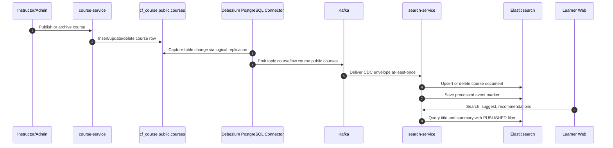
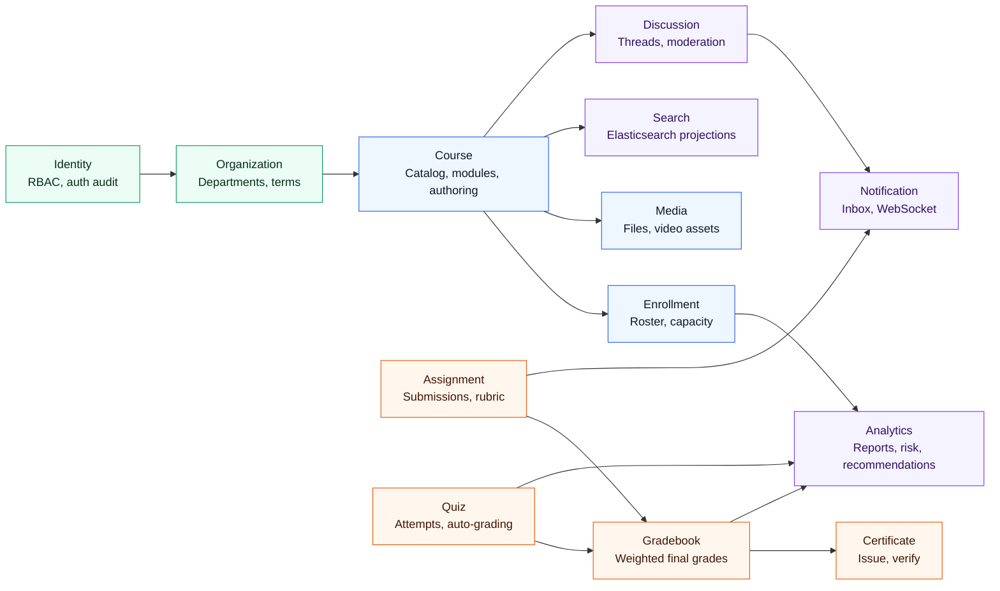
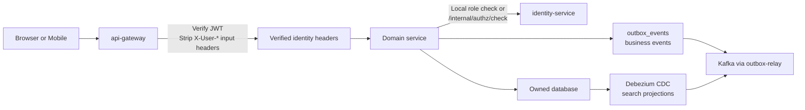

# CourseFlow LMS

CourseFlow is a production-minded learning management system for course discovery, authoring,
enrollment, learning delivery, assessment, grading, certificates, realtime collaboration and analytics.
The system is organized as independent business services with clear data ownership and event-driven
read models.

## Product Surface

```text
courseflow/
  backend/           Spring Boot microservices, gateway, workers and local infrastructure
  web/
    next-learning/   Learner/public web app, SEO-friendly course pages, realtime search
    react-admin/     Backoffice/admin console for operations and content management
  app/               Flutter learner mobile app
  docs/              Product and architecture notes
```

| Surface | Primary users | Main jobs |
|---|---|---|
| Learner web | Students, public visitors | Discover courses, watch lessons, track progress, take quizzes, view certificates |
| Admin web | Admins, instructors, operators | Author courses, manage enrollment, grade work, moderate discussions, inspect analytics |
| Mobile app | Students | Learn on the go, receive notifications, submit work, review progress |
| Backend APIs | Web/mobile clients, internal services | Auth, catalog, enrollment, media, search, analytics, grading, certification |

## Tech Stack

| Layer | Technology |
|---|---|
| Web learner | Next.js, React, TypeScript, TanStack Query, Tailwind CSS |
| Web admin | React, Vite, TypeScript, TanStack Query, Tailwind CSS, lucide-react |
| Mobile | Flutter |
| API and services | Java 21, Spring Boot 3, Spring Cloud Gateway |
| Identity | JWT, RBAC, service-to-service authorization checks |
| Data stores | PostgreSQL per service, MongoDB for document/chat style domains, Redis |
| Search | Elasticsearch, Spring Data Elasticsearch |
| Event backbone | Kafka, transactional outbox for business events, Debezium CDC for search projections, Kafka Connect |
| Object storage | MinIO/S3-compatible storage |
| Local platform | Docker Compose, Liquibase migrations |

## System Architecture

```mermaid
flowchart TB
  classDef client fill:#eef6ff,stroke:#2563eb,color:#0f172a
  classDef edge fill:#f8fafc,stroke:#64748b,color:#0f172a
  classDef svc fill:#ecfdf5,stroke:#059669,color:#052e16
  classDef data fill:#fff7ed,stroke:#ea580c,color:#431407
  classDef stream fill:#f5f3ff,stroke:#7c3aed,color:#2e1065

  subgraph Clients["Client Experiences"]
    Next["Learner Web\nNext.js"]
    Admin["Admin Web\nReact/Vite"]
    Mobile["Mobile App\nFlutter"]
  end

  Gateway["API Gateway\nJWT, CORS, Routing, Header Hardening"]

  subgraph Services["Business Services"]
    Identity["identity-service\nUsers, roles, permissions"]
    Org["organization-service\nDepartments, terms, sections"]
    Course["course-service\nCatalog, modules, authoring"]
    Enrollment["enrollment-service\nRoster, waitlist, capacity"]
    Assignment["assignment-service\nAssignments, submissions"]
    Quiz["quiz-service\nQuestion bank, attempts"]
    Gradebook["gradebook-service\nGrades, weights, overrides"]
    Media["media-service\nUploads, video metadata"]
    Notification["notification-service\nInbox, realtime push"]
    Discussion["discussion-service\nThreads, comments, moderation"]
    Certificate["certificate-service\nIssue and verify certificates"]
    Search["search-service\nCourse discovery read model"]
    Analytics["analytics-service\nReports, risk signals, recommendations"]
  end

  subgraph Stores["Owned Data Stores"]
    Pg["PostgreSQL\none DB per service"]
    Mongo["MongoDB\nportfolio/chat documents"]
    Es["Elasticsearch\ncourseflow-course-search"]
    Minio["MinIO/S3\nmedia and attachments"]
    Redis["Redis\ncache/pubsub-ready"]
  end

  subgraph Events["Event Backbone"]
    Kafka["Kafka"]
    Connect["Kafka Connect"]
    Debezium["Debezium CDC"]
  end

  Next --> Gateway
  Admin --> Gateway
  Mobile --> Gateway
  Gateway --> Identity
  Gateway --> Org
  Gateway --> Course
  Gateway --> Enrollment
  Gateway --> Assignment
  Gateway --> Quiz
  Gateway --> Gradebook
  Gateway --> Media
  Gateway --> Notification
  Gateway --> Discussion
  Gateway --> Certificate
  Gateway --> Search
  Gateway --> Analytics

  Identity --> Pg
  Org --> Pg
  Course --> Pg
  Enrollment --> Pg
  Assignment --> Pg
  Quiz --> Pg
  Gradebook --> Pg
  Certificate --> Pg
  Analytics --> Pg
  Media --> Minio
  Discussion --> Mongo
  Search --> Es
  Notification --> Redis

  Course --> Pg
  Pg --> Debezium
  Debezium --> Connect
  Connect --> Kafka
  Kafka --> Search
  Kafka --> Analytics
  Kafka --> Notification
  Kafka --> Gradebook
  Kafka --> Certificate

  class Next,Admin,Mobile client
  class Gateway edge
  class Identity,Org,Course,Enrollment,Assignment,Quiz,Gradebook,Media,Notification,Discussion,Certificate,Search,Analytics svc
  class Pg,Mongo,Es,Minio,Redis data
  class Kafka,Connect,Debezium stream
```



## Course Search Sync

Course search is an eventually consistent read model. The source of truth stays in `course-service`.
Elasticsearch sync is table CDC: Debezium captures changes from `cf_course.public.courses` and emits a
standard CDC envelope to Kafka. Business event flows still use `outbox_events`; the search projection
does not depend on outbox rows.



Important properties:

- `course-service` owns catalog data; `search-service` owns Elasticsearch documents.
- Debezium reads the `courses` table directly for ES projection sync.
- `search-service` treats events idempotently using the `courseflow-search-processed-events` index.
- `outbox-relay` remains available for business topics such as `course.published`.

## Bounded Contexts



## Runtime Request Flow



## Local Development

Start infrastructure only from `backend/`:

```bash
docker compose -f infra/docker/docker-compose.yml up -d
```

Start the full backend cluster:

```bash
docker compose \
  -f infra/docker/docker-compose.yml \
  -f infra/docker/docker-compose.services.yml \
  up --build
```

Run web apps separately:

```bash
cd web/next-learning
COURSEFLOW_API_URL=http://localhost:28080/api \
NEXT_PUBLIC_API_URL=http://localhost:28080/api \
npm run dev
```

```bash
cd web/react-admin
VITE_API_GATEWAY_URL=http://localhost:28080/api npm run dev
```

Default local URLs:

| Component | URL |
|---|---|
| Learner web | `http://localhost:3000` |
| Admin web | `http://localhost:5173` |
| API gateway | `http://localhost:28080/api` |
| Kafka Connect | `http://localhost:18083` |
| Elasticsearch | `http://localhost:9200` |
| MinIO console | `http://localhost:9001` |
| Keycloak | `http://localhost:18080` |

Check Debezium connector:

```bash
curl http://localhost:18083/connectors/courseflow-course-search-cdc/status
```

## Production Readiness Direction

The architecture is designed for production hardening, but local Compose is not production deployment.
Before a public/paid launch, CourseFlow needs:

- Managed PostgreSQL/Kafka/Elasticsearch/Object Storage or hardened equivalents.
- TLS, WAF/rate limiting, service network policy, gateway service-token attestation, secret
  management and rotation.
- Centralized logs, metrics, distributed tracing, SLOs, alerting and runbooks.
- CI/CD with unit, integration, contract, e2e, load and security tests.
- Backup/restore drills, migration rollback strategy and feature flags.
- Accessibility audit, enterprise SSO, SCORM/xAPI/LTI support and advanced reporting exports.

## References

- Backend architecture: `backend/docs/architecture/backend-architecture.md`
- Backend local infra: `backend/infra/docker/README.md`
- Local cluster guide: `backend/infra/docker/LOCAL_CLUSTER.md`
- Product hardening sprint: `backend/docs/operations/product-hardening-sprint.md`
- API overview: `backend/docs/api/courseflow-api.md`
