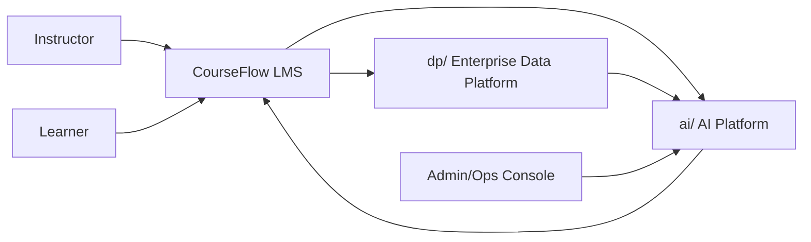
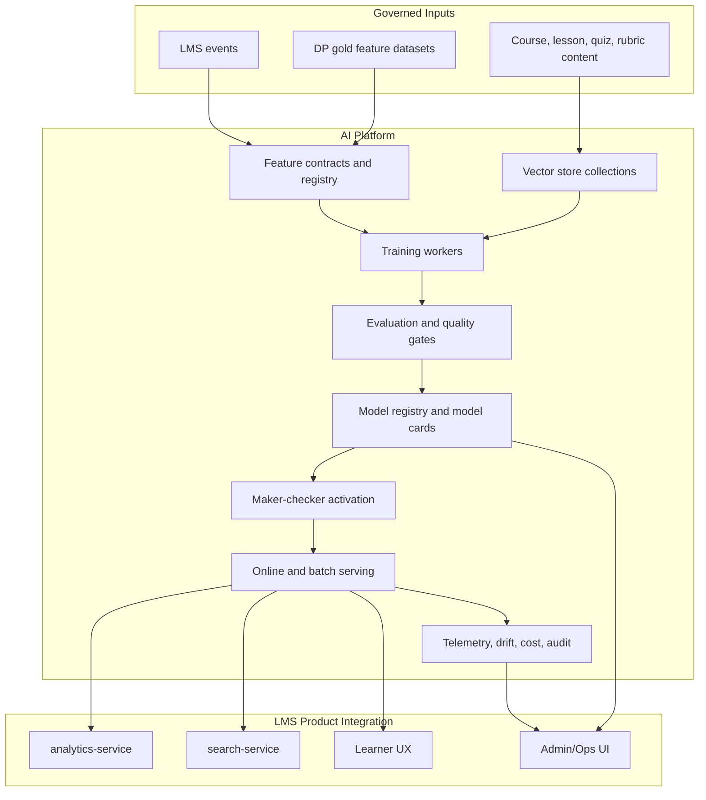

# AI Platform Architecture

## Purpose

CourseFlow AI Platform cung cấp một vòng đời AI thống nhất cho nhiều bài toán: recommendation, semantic search, RAG tutor, auto-grading, learner-risk, knowledge tracing, adaptive learning path và các use case enterprise sau này.

`dp/` chịu trách nhiệm data platform: contracts, ingestion, quality, lineage, lakehouse, semantic products. `ai/` chịu trách nhiệm AI platform: feature consumption, training, evaluation, model registry, serving, governance, monitoring và feedback loop.

## Context



AI platform không sở hữu transaction truth của LMS. Nó đọc tín hiệu đã được giới hạn, đã hash khi cần, hoặc feature dataset đã được govern từ `dp/`, sau đó trả về decision, score, explanation hoặc content suggestion cho product runtime.

## Layering

```text
Product layer
  products/lms-courseflow/
  use-cases/lms-ai-mentor/

Contract layer
  contracts/features/
  contracts/models/

Platform layer
  platform/capabilities/
  platform/coverage/
  platform/lifecycle/
  platform/evaluation/
  platform/governance/
  platform/vector-store/

Model family layer
  model-families/

Service layer
  services/recommendation-ml-service/
  future: semantic-search, rag-tutor, grading, learner-risk, model-ops
```

## Runtime Reference Architecture



## Core Capabilities

| Capability | Responsibility | First LMS consumer |
|---|---|---|
| Feature contracts | Define offline/online features, freshness, PII class, owner | learner-risk, recommendation |
| Business capability coverage | Map AI families to LMS and enterprise use cases with honest maturity status | AI Platform product council |
| Vector store | Manage content chunks, embeddings, retrieval metadata | semantic search, RAG tutor |
| Model registry | Store model versions, metrics, artifacts, lineage, status | recommendation |
| Evaluation | Run offline metrics, golden tests, LLM evals, bias/fairness checks | all AI Mentor modules |
| Governance | Approval, human-in-the-loop, retention, audit, rollback policy | recommendation, grading |
| Serving | Batch and online inference, active model routing, canary/shadow | recommendation, tutor |
| Observability | Latency, error, cost, drift, quality, fallback and audit metrics | ops/admin |

## Model Lifecycle

Every model follows the same lifecycle:

```text
idea -> use-case contract -> feature contract -> experiment -> train
-> evaluate -> register candidate -> quality gate -> maker-checker approval
-> activate -> serve -> monitor -> retrain or rollback
```

Recommendation already implements much of this lifecycle inside `services/recommendation-ml-service`. Shared model serving and retrieval now have sibling service packages, while the next platform step is to harden deployment gates and extract more reusable policy/artifact conventions so future services do not duplicate model ops from scratch.

## Service Boundaries

Keep the current recommendation service focused on recommendation decisions:

- related course recommendation
- future next-course/next-lesson recommendation
- model ranking/re-ranking for learning content

Current sibling services:

- `model-serving-service`
- `retrieval-service`
- `prompt-gateway-service`
- `llm-adapter-service`

New domains should become sibling services only when they require separate storage, SLA, security scope or model lifecycle:

- `semantic-embedding-service`
- `rag-tutor-service`
- `assessment-ai-service`
- `learner-risk-service`
- `model-ops-service`

Until a real runtime exists, proposed services should live as docs/contracts under `use-cases`, `contracts` and `platform`.

## Enterprise Readiness Gates

A use case is platform-ready when it has:

- Product brief and owner.
- Feature contract and model IO contract.
- Offline evaluation metrics and minimum gate.
- Model card template.
- Activation and rollback policy.
- Observability metrics.
- Privacy and retention classification.
- Test/evaluation plan with sample or synthetic data.
