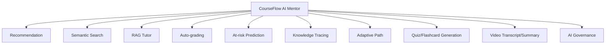

# CourseFlow AI Mentor Use Case

CourseFlow AI Mentor là umbrella use case cho LMS, được thiết kế cố ý đủ lớn để học nhiều họ AI nhưng vẫn có giá trị sản phẩm thật.

## Problem Statement

Learner thường không biết nên học gì tiếp theo, tìm nội dung bằng keyword dễ hụt ý nghĩa, không có người trả lời ngay khi kẹt bài, instructor bị quá tải chấm bài, còn admin không phát hiện sớm learner có nguy cơ bỏ học.

AI Mentor giải quyết bằng một bộ capability thống nhất thay vì các demo AI rời rạc.

## Capability Map

## Learning Path For The Builder

| Phase | What to build | What you learn |
|---|---|---|
| 0 | Platform structure, contracts, gates | AI architecture, MLOps boundaries |
| 1 | Embeddings search, LLM grading, at-risk baseline | embeddings, prompting, classical ML |
| 2 | RAG tutor, two-tower/SASRec recommendation | RAG, PyTorch, sequence models |
| 3 | Knowledge tracing, adaptive path | transformer, EdTech AI, bandit/RL |

## Definition Of Done

For each module:

- Product story and acceptance criteria exist.
- Feature contract and model IO contract exist.
- Offline evaluation metric and minimum gate exist.
- Model card and activation policy exist.
- Serving path and fallback behavior are documented.
- Observability and audit evidence are defined.

