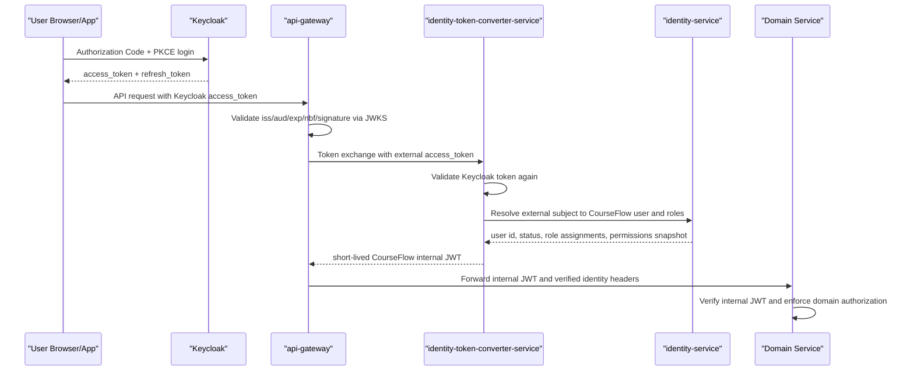

# Keycloak Enterprise Adoption for CourseFlow

## Decision

CourseFlow should adopt Keycloak as the external OAuth2/OpenID Connect Authorization Server, not as
the source of truth for LMS business authorization.

The enterprise target is:

- Keycloak owns authentication, SSO, MFA, identity brokering, OIDC clients, sessions, external access
  token issuance, key rotation and login policy.
- CourseFlow owns learner/admin profiles, LMS roles scoped to organizations/courses/sections,
  enrollment, instructor/reviewer/grader permissions, audit history and domain authorization.
- `api-gateway` is the only external API trust boundary.
- `identity-token-converter-service` becomes the CourseFlow internal security-token service. It
  validates Keycloak access tokens, resolves the CourseFlow user, enriches claims from CourseFlow
  authorization data, and issues short-lived internal tokens for downstream services.
- Downstream services validate only CourseFlow internal tokens for internal identity headers and
  service-to-service calls.

This is the same separation used in mature enterprise systems: the IdP proves who the caller is;
the product decides what the caller can do inside product-specific resources.

## Current State

The repository already contains a Keycloak container in local Docker, but Keycloak is not yet the
runtime authorization server for CourseFlow APIs.

Current runtime behavior:

- `identity-service` signs user access tokens with an HS256 shared secret.
- `api-gateway` validates those custom access tokens directly with `COURSEFLOW_JWT_SECRET`.
- `identity-token-converter-service` validates the same custom token and issues an internal JWT.
- `common-library` validates internal JWTs and protects propagated `X-User-*` headers.
- Keycloak is present as infrastructure, but it is not part of the login/token validation path.

That design is a good migration step away from raw service tokens, but it is not yet enterprise
identity architecture. The remaining gap is external OAuth2/OIDC integration and hardening of
internal token issuance.

## Target Flow

Important rules:

- APIs must accept Keycloak access tokens, not ID tokens.
- External tokens are validated locally with issuer and JWKS, not by calling Keycloak introspection
  on every request.
- Gateway validation is necessary but not sufficient. The token converter must validate the external
  token again because it is an internal security boundary.
- `X-User-*` remains a compatibility payload only. It is trusted only when an internal JWT verifies.
- User identity must be linked by immutable issuer plus subject, not by email alone after first
  provisioning.

## Keycloak Responsibility

Keycloak should be configured as the enterprise IAM layer:

| Area | Keycloak owns |
|---|---|
| Login | Authorization Code + PKCE for web, admin and mobile clients |
| SSO | Browser session, refresh token policy, logout endpoints |
| MFA | Required actions, OTP/WebAuthn where supported by the deployment |
| Federation | LDAP, SAML/OIDC identity providers, social login if needed |
| Token signing | External OAuth2 access tokens signed with asymmetric keys and exposed through JWKS |
| Session control | SSO lifetime, refresh token reuse, revocation, offline sessions if explicitly approved |
| Coarse IAM roles | Platform-level or client-level roles such as `platform-admin`, `support`, `tenant-admin` |
| Groups/organizations | Coarse institution or department membership used for provisioning and claim hints |
| Client policy | PKCE, redirect URI discipline, token lifetimes, optional FAPI/OAuth 2.1 style hardening |

Keycloak should not own high-cardinality LMS permissions such as:

- instructor of course 123
- grader for assignment 456
- reviewer for course draft 789
- learner enrolled in section ABC
- certificate eligibility
- grade override permission for one course

Those belong in CourseFlow services because they change with product workflows and need product
audit, product transactions and product-specific invariants.

## CourseFlow Responsibility

`identity-service` should evolve from custom password/JWT issuer into an IAM facade plus domain
authorization service:

- Maintain `users` as CourseFlow users with status, display name, preferences and audit state.
- Maintain a mapping table from external identities to CourseFlow users.
- Own role assignments, permissions and scoped memberships used by LMS workflows.
- Provide internal authorization checks such as `course:publish`, `gradebook:override`,
  `review:approve`, and scoped course/organization checks.
- Consume Keycloak/admin events or provisioning callbacks to sync user lifecycle when needed.
- Use Keycloak Admin API only from this facade, never directly from random domain services.

If profile complexity grows, split profile data into a dedicated user-management/profile service.
That service owns avatar, bio, locale, notification preferences and learner profile data. It should
not own password, sessions or access-token signing.

## Client Model

Recommended Keycloak clients:

| Client | Type | Flow | Notes |
|---|---|---|---|
| `courseflow-learner-web` | public | Authorization Code + PKCE | Next.js learner/public app |
| `courseflow-admin-web` | public or confidential BFF | Authorization Code + PKCE | Admin UI; gateway still enforces operator gate |
| `courseflow-mobile` | public native | Authorization Code + PKCE | No embedded password login |
| `courseflow-gateway` | confidential | Resource server / optional token exchange client | Validates tokens and calls converter |
| `courseflow-token-converter` | confidential | Token exchange / client credentials | Internal STS integration |
| `courseflow-service-*` | confidential | Client credentials if moving service tokens to Keycloak | Use only for machine actors |

Do not use Resource Owner Password Credentials / Direct Access Grants for normal login. It exposes
passwords to CourseFlow clients and bypasses the policy flexibility we want from Keycloak.

## Token Design

External Keycloak access token should carry only stable IAM facts:

- `iss`: Keycloak realm issuer, for example `https://auth.courseflow.example/realms/courseflow`
- `sub`: immutable Keycloak user id
- `aud`: API audience accepted by the gateway, for example `courseflow-api`
- `azp`: client id that obtained the token
- `scope`: OAuth scopes such as `openid profile email courseflow-api`
- coarse roles or groups when useful
- `email` and `email_verified` as profile hints, not primary identity keys

CourseFlow internal JWT should carry product facts with a very short TTL:

- `iss`: CourseFlow internal STS
- `aud`: target internal services or `courseflow-services`
- `token_use`: `internal`
- `actor_type`: `user` or `service`
- `uid`: CourseFlow user id
- `external_issuer` and `external_sub` for audit traceability
- `roles` and `role_assignments` from CourseFlow authorization
- `scope` or `scp` for internal service permissions
- `jti`, `iat`, `nbf`, `exp`

Enterprise hardening target: internal tokens should be asymmetrically signed by the converter/STS
and verified through an internal JWKS endpoint. Sharing one HMAC signing secret across all services
is acceptable only as a transition because any compromised service that can sign tokens can
impersonate other actors.

## Realm and Tenant Strategy

Default recommendation for CourseFlow: one Keycloak realm per environment/platform and represent
enterprise customers with organizations/groups plus CourseFlow tenant/org data.

Use one realm per tenant only when a tenant requires hard IAM isolation, custom realm-level policies,
separate SAML/OIDC federation lifecycle, or strict operational separation. Multi-realm SaaS is more
expensive to operate because every realm needs client config, keys, federation, policies, tests,
backups and upgrade validation.

CourseFlow tenant, department, course and section membership remains in CourseFlow databases. Keycloak
groups can help bootstrap or hint membership, but they should not become the LMS enrollment database.

## Production Keycloak Requirements

Keycloak cannot run in production as `start-dev`.

Production requirements:

- Run Keycloak behind HTTPS with a stable public hostname.
- Use an external production database with backup and restore drill.
- Pin a supported Keycloak version and define an upgrade playbook.
- Use asymmetric signing keys and key rotation policy.
- Disable default demo/admin credentials and protect the admin console behind private access.
- Configure exact redirect URIs and exact web origins.
- Disable Direct Access Grants unless there is an explicit machine-approved exception.
- Enable health, metrics, audit/admin events and log shipping.
- Configure SMTP for required actions and account recovery if email workflows are enabled.
- Export realm configuration as code for repeatable environments.
- Separate local/dev realm config from production realm config.

## Migration Plan

### Phase 1: OIDC verifier under the current gateway

- Add a gateway external-token verifier abstraction.
- Keep the current HS256 verifier temporarily for local compatibility.
- Add a Keycloak verifier using issuer URI, JWKS, audience validation and clock skew.
- Add the same verifier capability to `identity-token-converter-service`.
- Add tests for issuer mismatch, audience mismatch, expired token, key rotation and missing subject.

### Phase 2: Identity mapping and converter enrichment

- Add `user_external_identities` with `provider`, `issuer`, `subject`, `user_id`, `linked_at`,
  `last_seen_at`, `email_at_link`, `email_verified_at_link` and status.
- Token converter maps Keycloak `iss + sub` to CourseFlow `user_id`.
- First-time provisioning is explicit: invite, registration approval, SCIM, admin import or trusted
  JIT provisioning. Do not silently create privileged users from arbitrary email domains.
- Token converter enriches internal JWT from CourseFlow roles and scoped assignments.

### Phase 3: Client login migration

- Move learner web, admin web and mobile login to Authorization Code + PKCE.
- Remove password handling from frontend clients.
- Keep custom `/auth/login` only as a temporary legacy path with a deprecation flag.
- Move MFA and password reset flows to Keycloak required actions.
- Update logout to use OIDC logout and revoke/clear refresh tokens.

### Phase 4: Decommission custom external JWT

- Stop issuing CourseFlow HS256 user access tokens from `identity-service`.
- Remove `COURSEFLOW_JWT_SECRET` from external user auth paths.
- Keep `identity-service` for user lifecycle, profile, role assignment, authz checks and audit.
- Keep downstream services unchanged where possible because they already consume internal JWT.

### Phase 5: Harden internal service authentication

- Replace shared-secret internal JWT signing with STS-issued asymmetric tokens.
- Services verify internal JWT using STS JWKS.
- Service-to-service machine calls use client credentials, mTLS, or STS-issued service tokens with
  per-service audiences and scopes.
- Add token issuance metrics, failed conversion metrics, invalid internal JWT metrics and audit logs.

## Anti-Patterns to Avoid

- Do not put every course, section, assignment and enrollment permission into Keycloak roles.
- Do not let each microservice talk to Keycloak Admin API.
- Do not use password grant for the SPA/mobile login path.
- Do not validate every API request with remote introspection unless tokens are opaque.
- Do not accept ID tokens as API bearer tokens.
- Do not trust email as the permanent user key after identity linking.
- Do not expose Keycloak admin console publicly.
- Do not let internal services rely on `X-User-*` without internal token verification.
- Do not keep shared HMAC token signing as the final enterprise design.

## Production Readiness Gates

CourseFlow should not be called enterprise-ready for Keycloak until all gates pass:

- Gateway accepts a Keycloak RS256/ES256 access token and rejects wrong issuer, audience, expiry and
  unsigned/invalid signatures.
- Converter validates the same Keycloak token independently and issues a short-lived internal JWT.
- Domain services reject forged `X-User-*` headers without valid internal JWT.
- Frontend login uses Authorization Code + PKCE.
- Custom password grant/login is disabled or explicitly marked legacy.
- Identity mapping uses immutable Keycloak subject plus issuer.
- Admin/operator roles are coarse in Keycloak and fine-grained LMS permissions remain in CourseFlow.
- Realm config is repeatable from source-controlled configuration.
- Keycloak production deployment does not use `start-dev`.
- Keycloak database backup/restore and key rotation drills are documented.
- Auth failure, token conversion failure and authorization denial metrics exist.

## Recommended Backlog

P0:

- Add Keycloak OIDC/JWKS verifier in gateway and converter.
- Add `user_external_identities` mapping and resolver API in `identity-service`.
- Add realm/client bootstrap config for local dev.
- Switch web learner/admin login to Authorization Code + PKCE.
- Add negative security tests for invalid issuer/audience/signature and forged identity headers.

P1:

- Convert custom auth endpoints into IAM facade endpoints.
- Move MFA/password reset to Keycloak.
- Add Keycloak event sync for user lifecycle and audit.
- Add converter audit log and metrics.
- Add internal STS JWKS and asymmetric internal tokens.

P2:

- Add enterprise federation templates for SAML/OIDC tenants.
- Add SCIM or admin import for enterprise user provisioning.
- Add step-up MFA for sensitive admin actions.
- Add tenant-specific login branding if needed.
- Add FAPI/OAuth 2.1 client policies only if customer/regulatory needs justify them.

## References

- Keycloak OIDC endpoints and grant types:
  https://www.keycloak.org/securing-apps/oidc-layers
- Keycloak token exchange:
  https://www.keycloak.org/securing-apps/token-exchange
- Spring Security OAuth2 resource server JWT validation:
  https://docs.spring.io/spring-security/reference/servlet/oauth2/resource-server/jwt.html
- Keycloak Server Administration Guide:
  https://www.keycloak.org/docs/latest/server_admin/index.html
