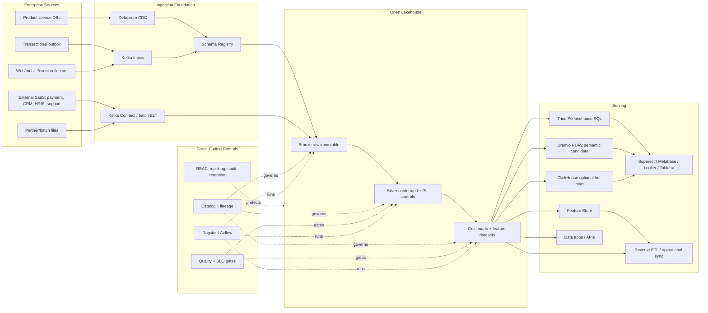

# Group Enterprise Data Platform Architecture

Status: draft for implementation

## Executive Decision

The group should build `df/` as a shared enterprise data platform, not as an LMS-only warehouse and
not as an extension of any backend analytics service. CourseFlow LMS is the first onboarded product
and the proving slice for ingestion, contracts, lakehouse modeling, quality, governance, BI and ML
handoff.

The normative scope charter is
[`architecture/enterprise-foundation-charter.md`](architecture/enterprise-foundation-charter.md).
Every shared platform capability must be reusable by the next product onboarded by the group, such as
commerce, CRM, payment, support, HRIS, identity, risk or AI applications.

This follows production patterns used by large-scale data organizations:

- Data Mesh ownership: product and domain teams own business meaning and data quality.
- Medallion layering: Bronze raw, Silver conformed and Gold business-ready data products.
- Kafka/outbox/CDC and governed connectors for reliable ingestion from product systems.
- Open table formats such as Iceberg for ACID, schema evolution and time travel on object storage.
- Catalog, lineage, contracts, PII classification, residency and retention as default controls.
- Feature store and reproducible Gold snapshots for ML/AI.
- Semantic/metrics layer for consistent enterprise reporting.

See [Reference Model Benchmark](architecture/reference-model-benchmark.md) for the external models
used to shape these decisions.

Capability maturity is tracked as architecture-as-code in `platform/capabilities/registry.yaml`.
The report CLI intentionally distinguishes documented or locally validated capabilities from
production-enforced runtime controls.

The P0 Data Product Control Tower is the first platform-heavy operating use case. It aggregates
catalog, lineage, contract, quality, access, release and capability evidence into
`data_product_control_tower_report.v1`. It is intentionally a blocking signoff report: until P0
capabilities reach production-enforced maturity and Gold data products have evidence, the report
returns `not_ready`.

## Target Architecture

## Boundary Decisions

| Boundary | Decision |
|---|---|
| Enterprise products | Remain OLTP owners. They publish outbox events, CDC feeds, SaaS exports or governed batch feeds. |
| `products/` | Product onboarding boundary. CourseFlow LMS is the first registered product. |
| `domains/` | Enterprise Data Mesh ownership layer for cross-product business semantics. |
| Backend analytics services | Operational read models and application APIs, not the enterprise warehouse. |
| ML services | Consume Gold snapshots or feature store datasets; do not read product OLTP databases. |
| `df/platform/` | Shared ingestion, lakehouse, processing, orchestration, quality, governance, security, serving, observability and developer experience. |
| Object storage | Stores Bronze/Silver/Gold tables and immutable pipeline artifacts. |
| BI/ML/reverse ETL | Read approved Gold, semantic or feature layers only. |

## Group-Wide Product Onboarding Model

Every enterprise product follows the same path:

1. Register product ownership under `products/<product-code>/`.
2. Inventory source services, databases, outbox topics, CDC streams, SaaS feeds and batch exports.
3. Define event, topic and data product contracts with product, domain owner, steward, residency,
   retention, access persona and consumer contract metadata.
4. Land immutable Bronze records with source offsets, snapshots, payload hash and replay evidence.
5. Build Silver conformed datasets with tenant, product, person, organization, time and PII controls.
6. Publish Gold data products only after SLO, quality, lineage and access-policy gates pass.
7. Serve consumers through approved Gold, semantic, BI, feature-store, API or reverse-ETL layers.

## Current First Product: CourseFlow LMS

CourseFlow LMS already has useful anchors for the first production slice:

- `analytics-service` owns operational reporting read models, marketing funnel ingestion,
  recommendation tracking and CSV exports.
- `outbox-relay` polls producer `outbox_events`, publishes Kafka messages and supports DLT
  replay/discard governance.
- Domain services already use database-per-service ownership and many producers have outbox events.
- Debezium exists for course search CDC, but not yet as a general Bronze lakehouse feed.
- Event contracts exist as Java records, but Kafka topics are not yet enforced by a schema registry.
- Recommendation ML is a Python boundary, but training must move to governed Gold snapshots instead
  of ad hoc analytics payloads.
- Prometheus/Grafana exist for service observability, but data freshness, quality and lineage must
  become first-class.

Primary enterprise gaps:

- Schema Registry and compatibility CI for platform-ingested events.
- Kafka Connect or equivalent lakehouse sink to Bronze.
- Object storage plus Iceberg/Delta/Hudi table format.
- dbt/Spark transformations with data tests and backfill.
- Dagster/Airflow orchestration.
- Catalog/lineage, PII classification, retention, residency and row-level access policy.
- OLAP/BI serving beyond operational CSV exports.
- Feature store and Gold snapshot handoff for ML.

## Reference Stack

| Capability | Preferred OSS Path | Managed Equivalent |
|---|---|---|
| Event backbone | Kafka | Confluent Cloud / MSK |
| CDC | Debezium | Confluent CDC / cloud-native CDC |
| Schema contract | Apicurio / Confluent Schema Registry | Confluent Schema Registry |
| Object storage | MinIO | S3 / GCS / ADLS |
| Table format | Apache Iceberg | Databricks Delta / managed Iceberg |
| Batch processing | Spark | Databricks / EMR / Dataproc |
| SQL transformation | dbt Core | dbt Cloud |
| Orchestration | Dagster first, Airflow acceptable | Dagster+ / Astronomer / MWAA |
| Catalog + lineage | DataHub / OpenMetadata | Atlan / Collibra |
| Quality | Great Expectations, Soda, dbt tests | Monte Carlo / Bigeye |
| P0 lakehouse SQL | Trino | Starburst |
| P1/P2 semantic lakehouse candidate | Dremio, only if POC proves superiority | Dremio Cloud |
| Hot analytical mart | ClickHouse, only when justified | ClickHouse Cloud |
| Distributed SQL / HTAP option | TiDB + TiFlash, only for measured operational service need | TiDB Cloud |
| BI | Superset / Metabase | Looker / Tableau |
| Feature store | Feast | Tecton / cloud-native feature store |

Recommendation: start with Kafka, Debezium, schema registry, MinIO/object storage, Iceberg, Spark,
dbt, Dagster, DataHub/OpenMetadata, Great Expectations/Soda, Trino, Superset/Metabase and Feast.
Evaluate Dremio in P1/P2 only after real Gold products exist and only adopt it if semantic-layer and
reflection value is clearly superior to the Trino + dbt + DataHub path. Keep ClickHouse for later hot
marts. Keep TiDB as a future operational distributed SQL/HTAP option, not the lakehouse foundation.

## Dremio and TiDB Decision

See [ADR 0002](adr/0002-dremio-and-tidb-serving-decision.md) and
[Technology Stack](technology-stack.md).

Short version:

- Trino is the P0 lakehouse SQL serving layer.
- Dremio is a P1/P2 candidate for semantic BI/self-service after Gold products are stable.
- ClickHouse remains optional for hot marts with demanding dashboard/event-query latency.
- TiDB is a P3+ operational database option for measured MySQL-compatible distributed SQL or HTAP
  needs; it does not replace the lakehouse.

## PO/BA Capability Map

| Capability | Group-wide use case | Data product examples | First enterprise contribution |
|---|---|---|---|
| Finance | Revenue, payment, discount, incentive, loyalty, reconciliation, margin. | `gold.finance_revenue_daily`, `gold.finance_benefit_reconciliation` | enrollment, promotion, loyalty, paid course, coupon, reward |
| Customer 360 | Customer/org lifecycle, engagement, health score and retention. | `gold.customer_360_profile`, `gold.org_account_health` | learner, organization, course activity, reviews, notifications |
| Risk/Fraud | Coupon abuse, payment anomaly, account abuse, certificate fraud. | `gold.risk_signal_daily`, `gold.fraud_case_queue` | quiz/grade anomalies, certificate issuance, coupon/loyalty abuse |
| HR/Workforce | Skill matrix, mandatory training, compliance learning, readiness. | `gold.workforce_skill_profile`, `gold.training_compliance_status` | completion, gradebook, certificate, course taxonomy |
| Product Analytics | Funnel, cohort, retention, feature usage and experiments. | `gold.product_usage_daily`, `gold.experiment_metrics_daily` | web/mobile/admin clickstream, enrollment funnel, learning runtime |
| ML/AI | Feature store, recommendation, next best action, churn/risk scoring. | `gold.recsys_interactions`, `gold.ml_feature_snapshot` | recommendation tracking, learner activity, course graph |
| Compliance | Audit, consent, access evidence, retention and PII controls. | `gold.compliance_retention_status`, `silver.audit_access_events` | access-control, entitlement, learner PII, course/org scope |
| Enterprise Reporting | KPI catalog, semantic layer and executive dashboards. | `gold.enterprise_kpi_daily`, `gold.executive_scorecard_daily`, semantic metric views | finance, customer, support, identity risk, recommendation and Control Tower metrics |

See [Enterprise Data Use-Case Roadmap](architecture/enterprise-use-case-roadmap.md) for the expanded
group-wide roadmap across identity, customer, revenue, workforce, product, support, risk, ML/AI and
compliance use cases.

## First Pilot Data Product Slice

Start with a narrow but real production slice. The current pilot happens to be CourseFlow LMS, but
the release mechanics, evidence, quality checks and serving model are platform patterns:

1. `course.published`, `enrollment.completed`, `gradebook.final_grade.updated`,
   `recommendation.impression`, `recommendation.click`.
2. Bronze raw event tables partitioned by `event_date`, `event_type` and `source_service`.
3. Silver conformed learner activity with tenant/product/org/course/person hash, event time and
   deduplicated source event id.
4. Gold `recsys_interactions` for ML and `learner_success_daily` for operations.
5. Data quality gates: unique event id, non-null domain keys, allowed event type, event-time bounds,
   tenant/org presence and freshness SLO.
6. Observability: pipeline status, freshness lag, rejected rows, duplicate count and Gold publish
   timestamp.

## Production Gates

The platform is not production-ready until these gates pass:

- Data contracts are versioned and compatibility-checked in CI.
- Kafka topics have schema registry enforcement for platform-ingested events.
- Source-to-Bronze activation has a passing readiness report with registry, schema, ingestion,
  replay, offset ledger, change-control, catalog and OpenLineage evidence.
- Bronze commit evidence includes source offset watermarks, record hash bindings and Iceberg snapshot
  metadata before production-like activation.
- Silver/Gold commit evidence includes Iceberg snapshot id, table metadata URI/hash, manifest-list
  URI/hash, contract hash, schema hash, partition spec hash, row count, content hash, release
  identity and upstream Bronze offset ledger hash before production-like publication.
- Bronze/Silver/Gold tables have catalog entries, owners, stewards, PII tags, residency and retention.
- Gold publication is blocked on quality failures.
- Production-impacting data platform changes require a registered change request with maker-checker
  approval, risk level, target environment, rollback evidence and impact assessment.
- Backfill/replay is governed by `backfill_readiness_report.v1`: bounded event-time and source
  ranges, tenant scope, dry-run/data-diff evidence, source offset ledger, lakehouse snapshot
  evidence, change-control, rollback, impact and communication are required before
  production-like execution or promotion.
- Cross-tenant and cross-product access is row-level isolated.
- Sensitive columns are masked or tokenized before self-service access.
- Data access is audited and correlated to user/service identity.
- Source onboarding, schema changes, catalog publish, semantic-layer changes and Gold publish actions
  have change-control evidence before production activation.
- Pipeline freshness, failure and volume SLOs alert through existing observability.
- ML training consumes a versioned Gold snapshot or feature store, not HTTP payload dumps from OLTP.

## Implementation Roadmap

### P0 - Platform Foundation

- Create event envelope and data product contract standard.
- Add product onboarding boundary and CourseFlow LMS pilot registration.
- Add schema registry decision and compatibility policy.
- Define Bronze lakehouse table naming, partitioning and retention.
- Stand up local object storage and table format plan.
- Create the first pipeline contract for recommendation interaction data.

### P1 - First Production Slice

- Ingest recommendation, enrollment, course and gradebook events.
- Build Silver learner activity and Gold recommendation interaction dataset.
- Add quality checks, freshness metrics and catalog registration.
- Wire recommendation ML training to consume Gold snapshot handoff.
- Publish first BI dashboard for learner success and course quality.

### P2 - Governance and Self-Service

- Add DataHub/OpenMetadata catalog ingestion.
- Add Dremio semantic views only after a successful POC.
- Add row/column-level access policy.
- Add governed exports, self-service discovery and semantic metric definitions.

### P3 - Advanced Platform

- Real-time features with Flink/Kafka Streams.
- Online feature store for low-latency recommendations and risk scoring.
- Experimentation metrics and causal analytics.
- Product onboarding workflow for CRM, HRIS, finance, support, commerce and other enterprise products.

## External References

- Data Mesh Architecture: https://www.datamesh-architecture.com/
- Martin Fowler, Data Mesh Principles: https://martinfowler.com/articles/data-mesh-principles.html
- Google Cloud, What is a data mesh: https://cloud.google.com/discover/what-is-data-mesh
- Google Cloud data mesh architecture: https://docs.cloud.google.com/architecture/data-mesh
- Microsoft Cloud Adoption Framework, unified data platform strategy: https://learn.microsoft.com/en-us/azure/cloud-adoption-framework/data/executive-strategy-unify-data-platform
- Databricks Medallion architecture: https://docs.databricks.com/aws/en/lakehouse/medallion
- Apache Iceberg table format: https://iceberg.apache.org/
- Debezium outbox and CDC patterns: https://debezium.io/blog/2019/02/19/reliable-microservices-data-exchange-with-the-outbox-pattern/
- DataHub catalog, lineage and governance: https://docs.datahub.com/docs/features
- Feast feature store: https://docs.feast.dev/
- dbt documentation and semantic layer: https://docs.getdbt.com/
- Dagster orchestration: https://dagster.io/
- Great Expectations data quality: https://greatexpectations.io/
- Dremio lakehouse catalogs: https://docs.dremio.com/current/data-sources/lakehouse-catalogs/
- Dremio Reflections: https://docs.dremio.com/current/reference/api/reflections/
- TiDB overview: https://docs.pingcap.com/tidb/stable/overview/
- TiFlash overview: https://docs.pingcap.com/tidb/stable/tiflash-overview/
